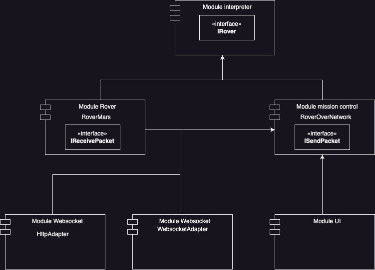

# 🚀 Mars Rover TS Fork - Ynov Architecture Logicielle

## 🧑🏽‍💻 `Developpement Context`

### _Team :_

- Remy Potus
- Dylan Antonnioti
- Julie Miller
- Hugo Denis
- Simon Deflesschouwer
- Pierre Pocheron

#

## 🏗️ `Getting started`

### install all dependencies

```sh
npm install
```

### Compile and Hot-Reload for Development

```sh
npm run dev
```

### Compile and Minify for Production

```sh
npm run build
```

### Run the tests

```sh
npm run test
```

#

## 🏛️ `Schéma d'architecture`



#

## 🎨 `Technology used`

- Vite
- TypeScript
- Socket.io
- Jest
